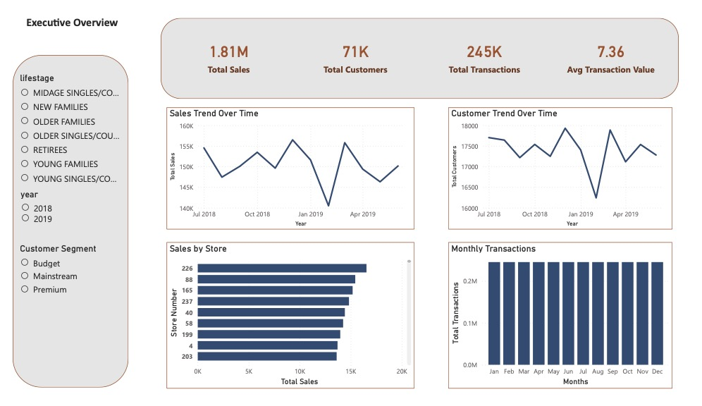
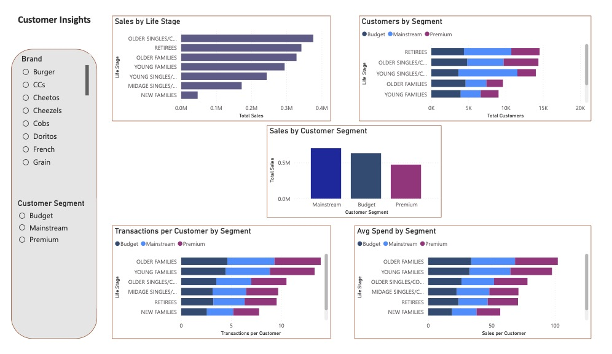
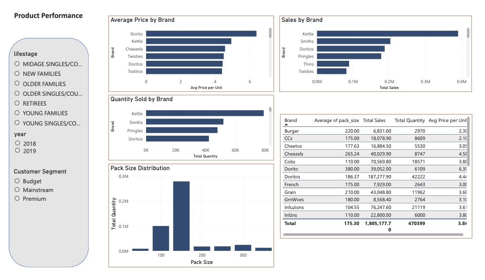
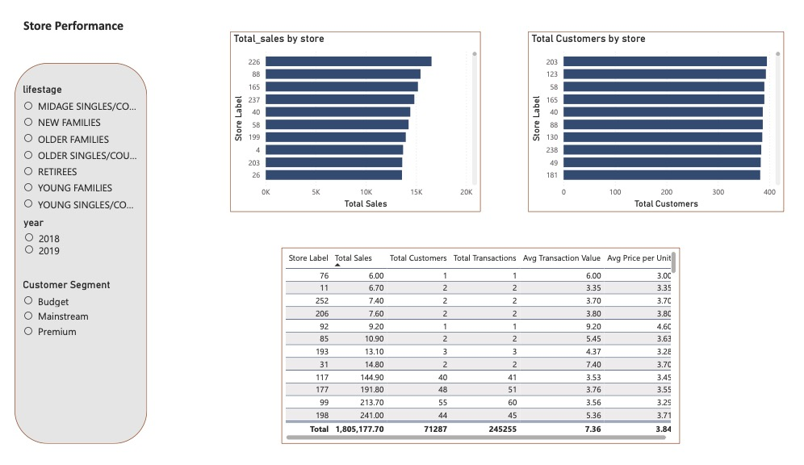
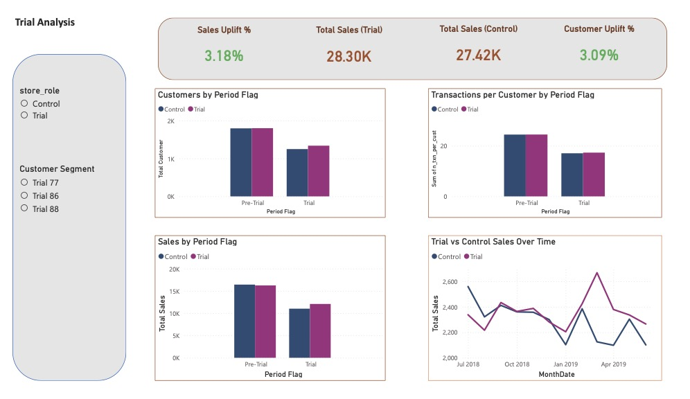

# Retail Store Trial Analysis (SQL, Python, Power BI)

## Overview

This project is based on the **Quantium Data Analytics Virtual Experience Program (Forage)** and has been independently extended into a complete **end-to-end analytics pipeline**.

While the original task focused on evaluating store trial performance, this project goes further by building the full workflow from raw data to business insights.

Enhancements include:

- Designing a custom SQL data cleaning process  
- Merging and transforming raw transactional and customer datasets  
- Building structured analytical datasets for performance analysis  
- Performing statistical uplift analysis using Python  
- Developing a business-focused Power BI dashboard  

---

## Objectives

The key objectives of this project were:

- Prepare clean, analysis-ready data from raw sources  
- Identify key customer segments and purchasing behaviour  
- Evaluate store trial performance  
- Determine whether sales uplift is driven by:
  - Increased customer traffic  
  - Increased spend per customer  
- Deliver actionable business insights through visualisation  

---

## Tools & Technologies

- **SQL (PostgreSQL)** → data cleaning, transformation, and aggregation  
- **Python (Pandas, SciPy)** → statistical analysis and uplift testing  
- **Power BI** → dashboard development and business visualisation  

---

## Data Pipeline

Raw Data → SQL Cleaning → Data Aggregation → Python Analysis → Power BI Dashboard  

---

## Data Preparation (SQL)

### Data Sources

- Transaction-level dataset (purchase data)  
- Customer purchase behaviour dataset  

### Data Processing Steps

- Merged transaction and customer datasets using a common customer identifier  
- Cleaned raw transactional data by removing invalid and inconsistent records  
- Standardised data formats (dates, product attributes)  
- Filtered outliers and irrelevant entries  

### Output Tables

- `clean_transactions` → cleaned and integrated dataset  
- `measure_over_time` → aggregated monthly store-level dataset  

### Key Metrics Created

- Total sales  
- Number of customers  
- Transactions per customer  
- Units per customer  
- Average price per unit  

These metrics enabled consistent comparison across stores and time periods.

---

## Trial Analysis (Python)

### Methodology

- Defined **pre-trial** and **trial** periods  
- Selected control stores based on similarity in pre-trial performance  
- Scaled control store metrics to match trial store magnitude  
- Calculated percentage differences between trial and control stores  
- Applied statistical testing (t-values) to assess significance  

### Purpose

To determine whether observed differences in performance were statistically significant and driven by real business changes rather than natural variation.

---

## Dashboard (Power BI)

The Power BI dashboard was designed to communicate insights in a clear, business-focused way.

### Retail Overview

- Total Sales, Customers, Transactions  
- Time-series analysis of performance trends  

### Customer Insights

- Sales by customer segment  
- Customer distribution by life stage and premium status  
- Behavioural metrics (transactions, spend patterns)  

### Trial Analysis

- Trial vs Control store comparison  
- Sales uplift and customer uplift metrics  
- Performance summary across stores  

---

## Key Insights

### Store 77
- Strong uplift in both sales and customer numbers  
- Trial was highly successful  
- Growth primarily driven by increased customer traffic  

### Store 86
- Increase in customer numbers observed  
- Sales uplift inconsistent  
- Results inconclusive  

### Store 88
- Increase in sales observed  
- Limited growth in customer numbers  
- Growth driven by purchasing behaviour rather than traffic  

---

## Business Recommendations

- Expand the strategy implemented in **Store 77**  
- Focus on high-value customer segments:
  - Older Families  
  - Young Singles/Couples  
- Investigate pricing and promotional strategies  
- Reassess execution in stores with inconsistent performance  

---

## Skills Demonstrated

- SQL data cleaning and transformation  
- Feature engineering and data aggregation  
- Statistical testing and uplift analysis (Python)  
- Business insight generation  
- Data storytelling and dashboard design (Power BI)  

---

## Dashboard Preview

### Executive Overview

### Customer Insights

### Product Performance

### Store Performance

###  Trial Analysis
