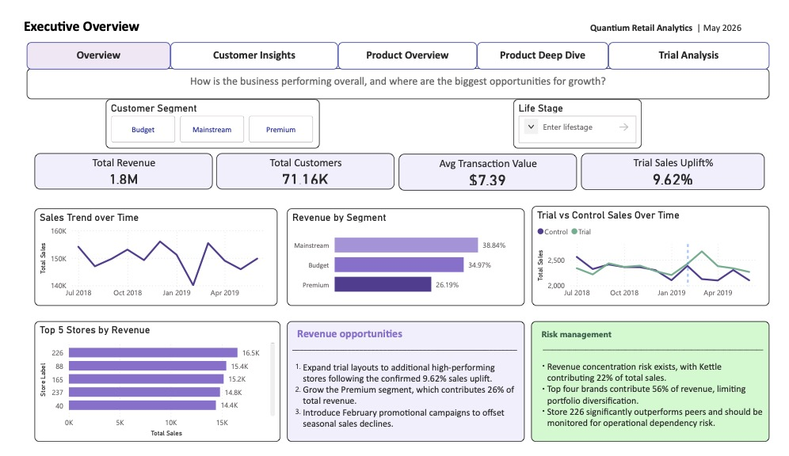
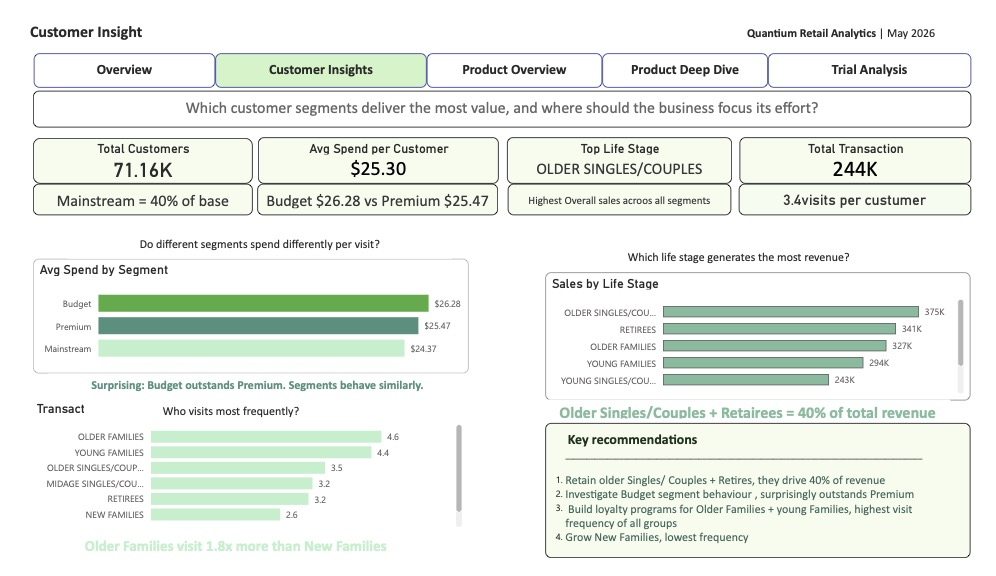
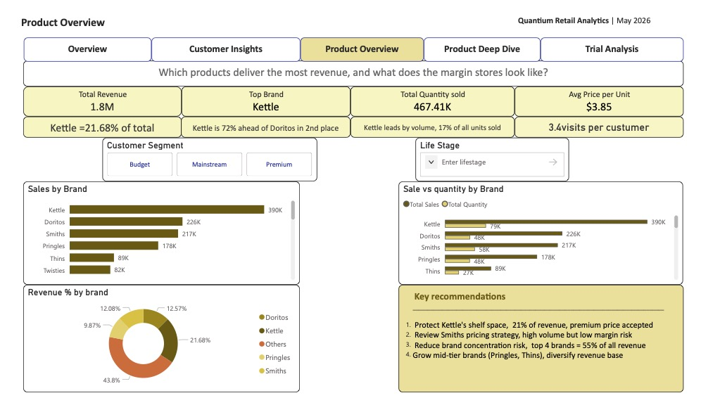
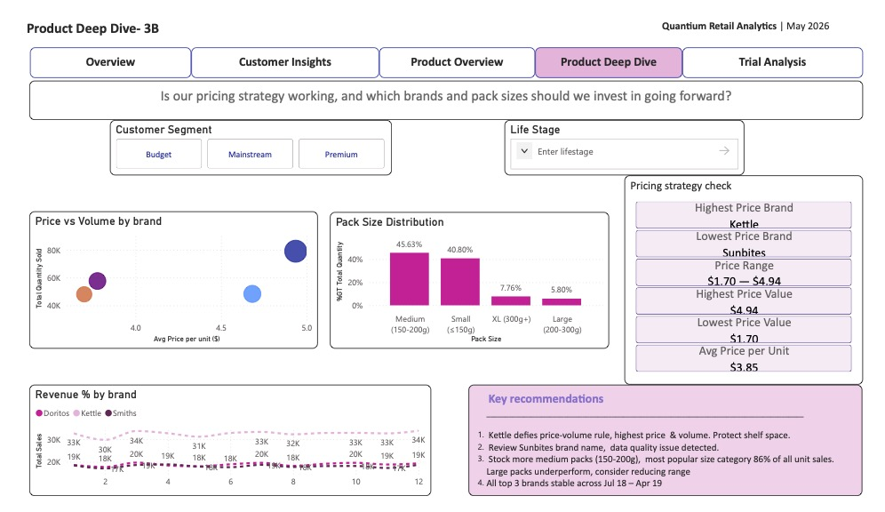
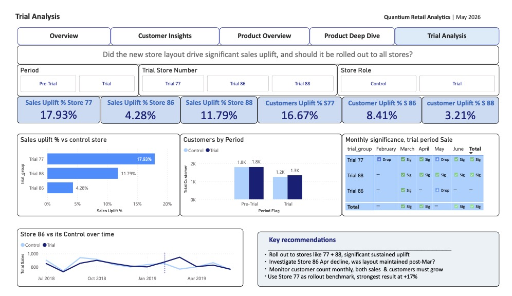

# Retail Store Trial Analysis (SQL, Python & Power BI)

## Overview

This project is based on the **Quantium Data Analytics Virtual Experience Program (Forage)** and has been independently extended into a complete **end-to-end analytics pipeline**.

While the original task focused on evaluating store trial performance, this project goes further by building the full workflow from raw transactional data through to a business-facing Power BI report covering customers, products, pricing and the store trial.

Enhancements include:

- A custom SQL data-cleaning and enrichment process (PostgreSQL views)
- Merging and transforming raw transaction and customer datasets
- Brand standardisation and pack-size feature engineering
- Control-store matching and uplift calculation in SQL
- Statistical significance testing of the trial in Python (scaled-control t-test)
- A five-page, business-focused Power BI dashboard

---

## Objectives

- Prepare clean, analysis-ready data from raw sources
- Identify the customer segments and life stages that deliver the most value
- Understand product and brand performance, pricing and pack-size mix
- Evaluate store trial performance against matched control stores
- Determine whether sales uplift is driven by **increased customer traffic** or **increased spend per customer**
- Deliver actionable business insights through visualisation

---

## Tools & Technologies

- **SQL (PostgreSQL)** → data cleaning, enrichment, aggregation, control-store matching and uplift calculation
- **Python (Pandas, SciPy)** → statistical significance testing of the trial uplift
- **Power BI** → dashboard development and business visualisation

> Note: control-store matching and uplift sizing are done in SQL; the monthly Sig/Drop flags on the Trial Analysis page come from the Python significance test of each trial store against its scaled control.

---

## Data Pipeline

```
Raw Data  →  SQL Cleaning  →  Enrichment & Aggregation  →  Control Matching & Uplift (SQL)  →  Significance Testing (Python)  →  Power BI Dashboard
```

---

## Repository Structure

```
.
├── SQL.sql                         # Cleaning, enrichment, segmentation and trial/control matching
├── Scripts/
│   └── Quantim_python.ipynb        # Significance testing of trial uplift (Pandas + SciPy)
├── Power_BI/
│   └── Quantium_Dashboards.pbix    # Power BI report (5 pages)
├── Images/                         # Dashboard page exports used in this README
│   ├── Quantium_Dashboards_1.jpg
│   ├── Quantium_Dashboards_2.jpg
│   ├── Quantium_Dashboards_3.jpg
│   ├── Quantium_Dashboards_4.jpg
│   └── Quantium_Dashboards_5.jpg
└── README.md
```

---

## Data Preparation (SQL)

### Data Sources

- `transactions` → transaction-level purchase data (chips category)
- `customers` → customer life stage and premium/budget classification

The dataset spans **July 2018 – June 2019**.

### Data Processing Steps

- Converted the Excel serial `date` column into a proper `DATE` (`date_dt`)
- Removed non-chip products (any product name containing *salsa*)
- Removed outliers: a bulk-buyer loyalty card (`226000`) and an abnormal quantity record (`prod_qty = 200`)
- Cleaned whitespace in product names and extracted `pack_size` from the product name
- Standardised brand names from abbreviations (e.g. `WW → Woolworths`, `RRD → Red Rock Deli`, `Dorito → Doritos`, `Smith → Smiths`, `GrnWves → Grain Waves`)
- Merged transactions with customer segments on `lylty_card_nbr`

### Key Views Created

- `transactions_clean` → cleaned transactions with standardised brand and pack size
- `transactions_enriched` → cleaned transactions joined to customer segment, with unit price and date parts
- `measure_over_time` → monthly store-level metrics
- `pretrial_measures` → pre-trial monthly metrics for full-year stores only
- `powerbi_trial_dataset` → trial/control dataset shaped for Power BI

### Key Metrics Created

- Total sales
- Number of customers
- Transactions per customer
- Units (chips) per customer
- Average price per unit

These metrics enabled consistent comparison across stores and time periods.

---

## Trial Analysis (SQL + Python)

### Control-Store Matching (SQL)

- Split the timeline into a **pre-trial** period (before `201902`) and a **trial** period (`201902`–`201906`)
- Restricted candidates to stores with a full 12 months of observations
- Selected control stores by minimising the absolute difference in monthly **total sales** and **customer counts** against each trial store during the pre-trial period
- Calculated sales uplift and customer uplift as the percentage difference between each trial store and its matched control during the trial period

### Trial / Control Pairs

| Trial store | Matched control |
|-------------|-----------------|
| 77          | 233             |
| 86          | 155             |
| 88          | 237             |

### Significance Testing (Python)

The notebook in `Scripts/` reads the exported `measure_over_time.csv` and tests whether the trial-period gap is statistically significant rather than normal variation:

- Scales the control store to the trial store using the pre-trial sum ratio
- Measures the percentage difference between trial and scaled control each month
- Builds a t-value for each trial month against the pre-trial mean and standard deviation
- Compares it to the one-sided 95% critical value to flag significant months

Significance was tested for both total sales and customer counts across the early trial months (Feb–Apr 2019), and these flags feed the monthly Sig/Drop summary on the Trial Analysis dashboard.

### Purpose

To determine whether observed differences in performance were genuine, and whether any uplift was driven by more customers or by higher spend per customer.

---

## Dashboard (Power BI)

The report is organised into five pages, each answering a specific business question.

### 1. Executive Overview
*How is the business performing overall, and where are the biggest opportunities for growth?*
- Total Revenue **1.8M**, Total Customers **71.16K**, Avg Transaction Value **$7.39**, Trial Sales Uplift **9.62%**
- Sales trend over time, revenue by segment, and trial vs control sales
- Revenue opportunities and risk management call-outs

### 2. Customer Insights
*Which customer segments deliver the most value, and where should the business focus?*
- Avg spend per customer **$25.30**, **244K** transactions, **3.4** visits per customer
- Sales by life stage, average spend by segment, and visit frequency
- Older Singles/Couples + Retirees account for ~40% of revenue

### 3. Product Overview
*Which products deliver the most revenue, and what does the brand mix look like?*
- Total Quantity sold **467.41K**, Avg Price per Unit **$3.85**
- Sales by brand, sales vs quantity, and revenue share by brand
- Kettle is the top brand at **21.68%** of revenue; top four brands ≈ 55% (concentration risk)

### 4. Product Deep Dive
*Is the pricing strategy working, and which brands and pack sizes should we invest in?*
- Price vs volume by brand, pack-size distribution, and a pricing-strategy summary
- Medium (150–200g) and Small (≤150g) packs make up **~86%** of unit sales
- Data-quality flag raised on the Sunbites brand name

### 5. Trial Analysis
*Did the new store layout drive a significant sales uplift, and should it be rolled out?*
- Sales and customer uplift per trial store vs control
- Customers by period and monthly significance summary

---

## Key Insights

### Store 77
- Strong uplift in **both** sales (**+17.93%**) and customers (**+16.67%**)
- Trial highly successful, with growth primarily driven by increased customer traffic
- Best candidate to use as the rollout benchmark

### Store 86
- Customer uplift (**+8.41%**) outpaced sales uplift (**+4.28%**)
- Results inconsistent, with a notable decline in April
- Inconclusive — worth investigating whether the layout was maintained post-March

### Store 88
- Sales uplift (**+11.79%**) well ahead of customer uplift (**+3.21%**)
- Growth driven by higher spend per visit rather than additional traffic

### Product & Customer
- Budget customers spend slightly more per head (**$26.28**) than Premium (**$25.47**) — a surprising result worth investigating
- Older Families and Young Families visit most frequently
- Revenue is concentrated in a few brands and in Store 226, creating dependency risk

---

## Business Recommendations

- Roll out the **Store 77** layout to similar high-performing stores; treat 77 as the benchmark
- Investigate **Store 86** before any wider rollout
- Retain high-value life stages (**Older Singles/Couples**, **Retirees**) that drive ~40% of revenue
- Build loyalty programs for the most frequent visitors (**Older Families**, **Young Families**) and grow **New Families**
- Protect Kettle's shelf space while diversifying away from heavy brand concentration
- Stock more Medium and Small packs in line with demand, and reduce Large pack range
- Review the Sunbites brand-name data-quality issue

---

## Dashboard Preview

### Executive Overview


### Customer Insights


### Product Overview


### Product Deep Dive


### Trial Analysis
